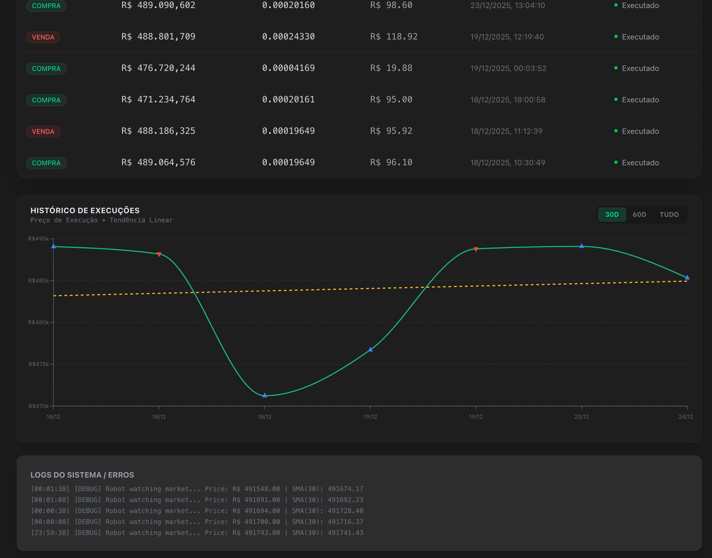
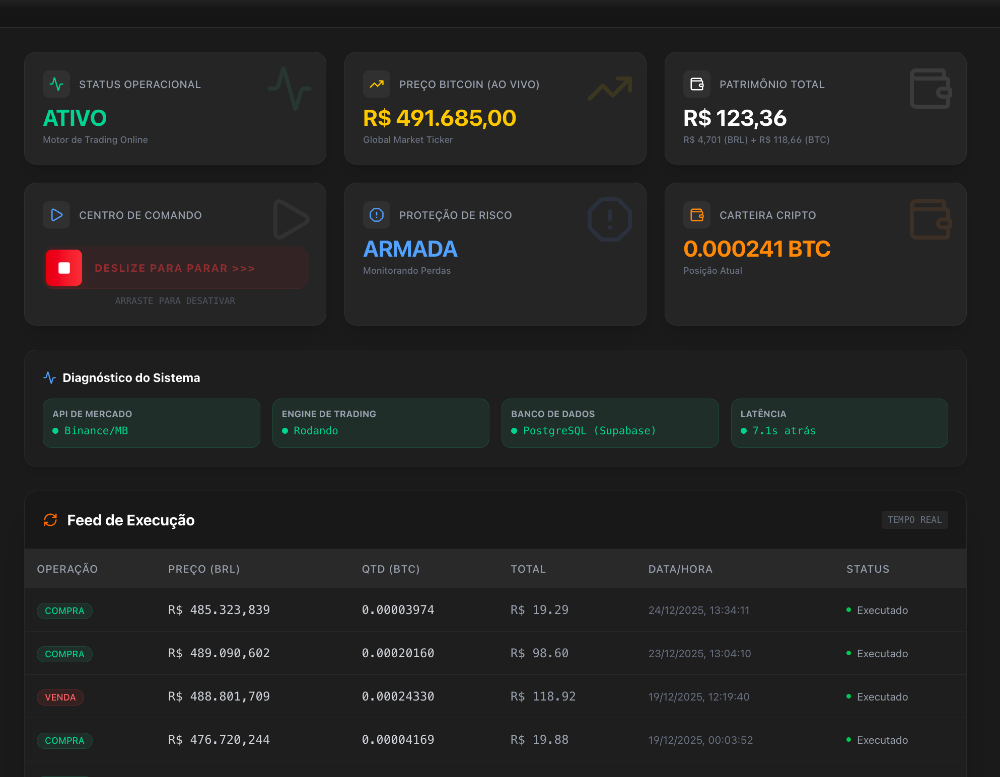

# BitcompraVendeAutomatico 🤖💰
> **Robô de Trading de Bitcoin com Proteção de Lucro e Interface Reativa**



Este projeto é um **sistema completo de trading automatizado de criptomoedas** (Paper Trading), desenvolvido para operar 24/7 com estratégias robustas de gerenciamento de risco e execução.

Ele não apenas compra e vende baseado em indicadores técnicos, mas possui uma **inteligência de defesa de lucros** que protege o capital quando o mercado vira, além de uma interface moderna para monitoramento em tempo real.

---

## 🚀 Diferenciais e Lógica de Negociação

O robô opera com uma arquitetura de microsserviços (Backend Python + Frontend React) e utiliza uma estratégia híbrida focada em **Tendência e Segurança**.

### 1. Estratégia Principal: SMA Crossover (Cruzamento de Médias)
O motor de decisão monitora o Bitcoin a cada segundo e utiliza duas Médias Móveis Simples (SMA):
- **Curta (30 períodos):** Reage rápido à volatilidade recente.
- **Longa (120 períodos):** Identifica a tendência macro.

**Sinal de Compra:** Quando a média curta cruza acima da longa (Golden Cross), indicando início de tendência de alta.
**Sinal de Venda:** Quando a média curta cruza abaixo da longa (Death Cross), indicando reversão.

### 2. Profit Protection (Proteção de Lucro) 🛡️
Diferente de bots comuns que "devolvem" o lucro quando o mercado cai devagar, este sistema implementa um **Trailing Stop Logico**:
- **O Gatilho:** Se o robô já está com um lucro não realizado significativo e o preço "estica" demais (> 2% acima da média longa).
- **A Ação:** Se, nesse cenário de euforia, o preço perder força e cruzar abaixo da média curta (antes do cruzamento total das médias), o robô **VENDE IMEDIATAMENTE**.
- **O Resultado:** Em vez de esperar o mercado cair tudo para vender, ele "garante" o topo e sai com o dinheiro no bolso.

### 3. Risk Engine (Motor de Risco) ⚠️
- **Kill Switch:** O bot desliga automaticamente se o drawdown (queda do capital) atingir 30%.
- **Gestão de Banca:** Entra em cada operação com 80% do saldo disponível (configurável), maximizando o retorno na tendência.

---

## 📊 Interface de Comando (Dashboard)

A interface foi desenhada para ser informativa e segura.

### Feed de Execução e Gráfico em Tempo Real

*Visualização clara das operações com marcadores de Compra/Venda e linha de tendência.*

- **Swipe to Confirm:** Botões de ação críticas (Iniciar/Parar) exigem um gesto de "arrastar", prevenindo cliques acidentais.
- **Logs ao Vivo:** Monitoramento transparente do que o cérebro do robô está "pensando".
- **Saúde do Sistema:** Status de conexão com Binance/Mercado Bitcoin, latência e uso de banco de dados.

---

## 🛠️ Stack Tecnológico

- **Backend:** Python 3.9 (FastAPI) - Motor de cálculo e execução.
- **Frontend:** React + Vite + TailwindCSS - Dashboard interativo.
- **Gráficos:** Recharts (D3.js wrapper) - Visualização de dados de alta performance.
- **Banco de Dados:** Supabase (PostgreSQL) - Persistência segura de trades e histórico.
- **Infraestrutura:** Docker & Docker Compose - Deploy simplificado agnóstico de ambiente.

## 📦 Como Rodar

```bash
# Clone o repositório
git clone https://github.com/athossouza/BitcompraVendeAutomatico.git

# Configure as variáveis de ambiente
cp .env.example backend/.env

# Inicie o sistema via Docker
docker-compose up --build
```

---

_Desenvolvido para fins educacionais e de simulação de mercado._
